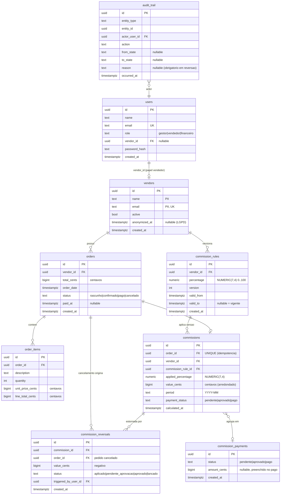
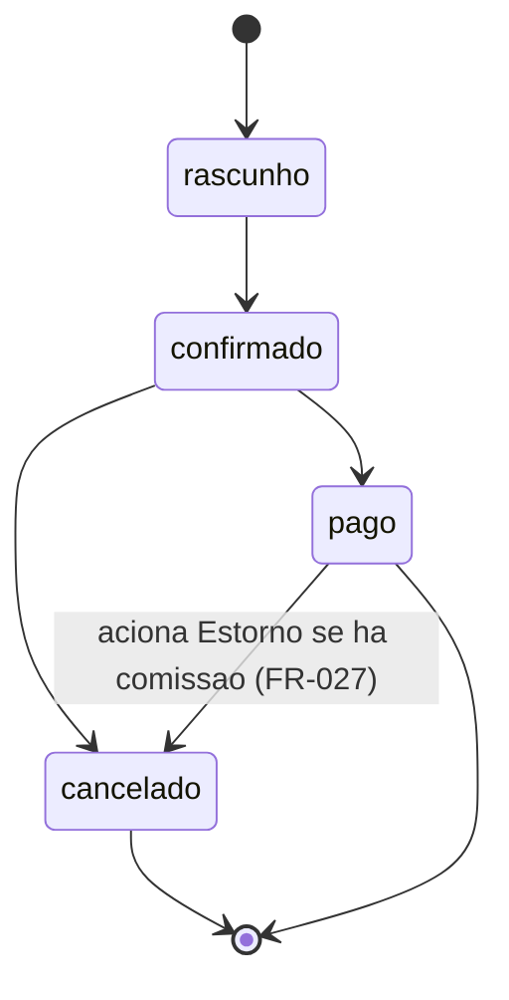
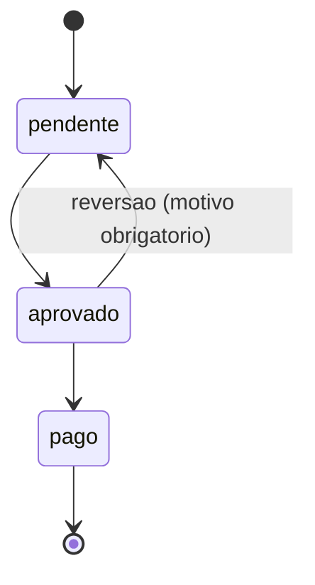

# Data Model — Financial Dashboard

**Feature**: `financial-dashboard`
**Gerado por**: agente-00c, onda-005 (etapa plan)
**Predecessor**: spec.md (Key Entities), research.md (Decisions 1–8)

> P-III (precisao monetaria): TODA coluna monetaria e `BIGINT` (centavos) ou
> `NUMERIC` — ZERO colunas `float`/`double`/`real` (SC-007). Percentual e
> `NUMERIC(7,4)`. P-I (auditabilidade): tabelas financeiras append-only com
> trigger anti-UPDATE/DELETE.

---

## DER (visao geral)



---

## Entity: User (Usuario)

Ator autenticado. Suporta RBAC (P-IV).

| Campo | Tipo | Constraints | Notas |
|-------|------|-------------|-------|
| id | UUID | PK | |
| name | TEXT | NOT NULL | |
| email | TEXT | NOT NULL, UNIQUE | login |
| role | TEXT | NOT NULL, CHECK in (gestor,vendedor,financeiro) | P-IV |
| vendor_id | UUID | FK→vendors, NULL | obrigatorio sse role=vendedor (CHECK) |
| password_hash | TEXT | NOT NULL | bcrypt/argon2; nunca plaintext |
| created_at | TIMESTAMPTZ | NOT NULL DEFAULT now() | UTC |

**CHECK**: `(role = 'vendedor') = (vendor_id IS NOT NULL)` — vendedor sempre
vinculado; demais papeis sem vendor_id.

---

## Entity: Vendor (Vendedor) — PII / LGPD (P-V)

| Campo | Tipo | Constraints | Finalidade LGPD (SC-008) |
|-------|------|-------------|--------------------------|
| id | UUID | PK | identificacao (nao-PII) |
| name | TEXT | NOT NULL | identificacao do vendedor para apuracao/dashboard |
| email | TEXT | NOT NULL, UNIQUE | contato / notificacao futura |
| active | BOOL | NOT NULL DEFAULT true | desativacao (FR-001) |
| anonymized_at | TIMESTAMPTZ | NULL | marca exclusao LGPD (FR-005) |
| created_at | TIMESTAMPTZ | NOT NULL DEFAULT now() | auditoria |

> Apenas 4 campos pessoais (name, email, id implicito, + percentual via
> commission_rules) — minimizacao P-V/FR-004. Anonimizacao: `name`/`email`
> → token, `anonymized_at` setado; linha preservada (P-I prevalece, FR-005).
> Desativar (`active=false`) != anonimizar.

---

## Entity: CommissionRule (Regra de Comissao) — imutavel, versionada (P-II)

| Campo | Tipo | Constraints | Notas |
|-------|------|-------------|-------|
| id | UUID | PK | |
| vendor_id | UUID | FK→vendors NOT NULL | |
| percentage | NUMERIC(7,4) | NOT NULL, CHECK 0..100 | FR-002; sem float (P-III) |
| version | INT | NOT NULL | sequencial por vendedor |
| valid_from | TIMESTAMPTZ | NOT NULL | inicio de vigencia |
| valid_to | TIMESTAMPTZ | NULL | NULL = vigente |
| created_at | TIMESTAMPTZ | NOT NULL DEFAULT now() | |

**Invariantes**: append-only (trigger anti UPDATE/DELETE, exceto fechar
`valid_to` da versao anterior na criacao da nova — feito via funcao
controlada). Intervalos `[valid_from, valid_to)` por vendedor MUST NOT
sobrepor. **UNIQUE (vendor_id, version)**.

**Selecao da regra vigente (FR-012, dec-020)**: para `order_date`:
`valid_from <= order_date AND (valid_to IS NULL OR order_date < valid_to)`.

---

## Entity: Order (Pedido) — maquina de estado (FR-008)

| Campo | Tipo | Constraints | Notas |
|-------|------|-------------|-------|
| id | UUID | PK | |
| vendor_id | UUID | FK→vendors NOT NULL | |
| total_cents | BIGINT | NOT NULL, CHECK >= 0 | centavos (P-III); = SUM(itens) se houver itens (FR-010) |
| order_date | TIMESTAMPTZ | NOT NULL | base da regra vigente (FR-012) |
| status | TEXT | NOT NULL, CHECK in (rascunho,confirmado,pago,cancelado) | |
| paid_at | TIMESTAMPTZ | NULL | setado na transicao →pago |
| created_at | TIMESTAMPTZ | NOT NULL DEFAULT now() | |

### State machine (FR-008, dec-019)



Transicoes validas: `rascunho→confirmado`, `confirmado→pago`,
`confirmado→cancelado`, `pago→cancelado`. **Todas as demais REJEITADAS**
(ex: `pago→rascunho` — Acceptance Scenario US2.3). Cada transicao grava em
`audit_trail` na mesma transacao (FR-009, P-I).

---

## Entity: OrderItem (Item de Pedido) — FR-010

| Campo | Tipo | Constraints | Notas |
|-------|------|-------------|-------|
| id | UUID | PK | |
| order_id | UUID | FK→orders NOT NULL ON DELETE no-op | |
| description | TEXT | NOT NULL | produto/descricao |
| quantity | INT | NOT NULL, CHECK > 0 | |
| unit_price_cents | BIGINT | NOT NULL, CHECK >= 0 | centavos |
| line_total_cents | BIGINT | NOT NULL | = quantity * unit_price_cents |

**Invariante (FR-010)**: quando ha itens, `orders.total_cents =
SUM(order_items.line_total_cents)` — validado no service e por teste.

---

## Entity: Commission (Comissao) — imutavel, idempotente (P-I, P-II)

| Campo | Tipo | Constraints | Notas |
|-------|------|-------------|-------|
| id | UUID | PK | |
| order_id | UUID | FK→orders, **UNIQUE** | idempotencia (FR-014, dec-028) |
| vendor_id | UUID | FK→vendors NOT NULL | |
| commission_rule_id | UUID | FK→commission_rules NOT NULL | versao aplicada (FR-013) |
| applied_percentage | NUMERIC(7,4) | NOT NULL | snapshot do percentual (P-I) |
| value_cents | BIGINT | NOT NULL, CHECK >= 0 | centavos, arredondado half-up (dec-025) |
| period | TEXT | NOT NULL | "YYYY-MM" (FR-015) |
| payment_status | TEXT | NOT NULL DEFAULT 'pendente', CHECK in (pendente,aprovado,pago) | FR-020 |
| calculated_at | TIMESTAMPTZ | NOT NULL DEFAULT now() | |

**Imutavel pos-insert** (trigger anti UPDATE/DELETE; excecao controlada:
transicao de `payment_status` via funcao validada que tambem grava
audit_trail). **value_cents** = `RoundCommission(order.total_cents *
applied_percentage / 100)` (dec-025). Referencia imutavel ao pedido,
vendedor, percentual e versao de regra (FR-013, P-I).

### State machine de pagamento (FR-020)



Demais transicoes REJEITADAS. Cada transicao grava `audit_trail` com ator,
timestamp, from/to e `reason` (obrigatorio em `aprovado→pendente`)
(FR-021, SC-006).

---

## Entity: CommissionReversal (Estorno de Comissao) — imutavel (FR-027..029)

| Campo | Tipo | Constraints | Notas |
|-------|------|-------------|-------|
| id | UUID | PK | |
| commission_id | UUID | FK→commissions NOT NULL | origem (FR-027) |
| order_id | UUID | FK→orders NOT NULL | pedido cancelado |
| value_cents | BIGINT | NOT NULL, CHECK < 0 | NEGATIVO, espelho da comissao (FR-027) |
| status | TEXT | NOT NULL, CHECK in (aplicado,pendente_aprovacao,aprovado,lancado) | FR-028 |
| triggered_by_user_id | UUID | FK→users NOT NULL | ator do cancelamento |
| created_at | TIMESTAMPTZ | NOT NULL DEFAULT now() | UTC (FR-027) |

**Regra de criacao (FR-028)**: ao cancelar pedido `pago` com comissao:
- comissao origem `pendente` → estorno nasce `aplicado` (zera liquido direto);
- comissao origem `aprovado`/`pago` → estorno nasce `pendente_aprovacao`
  (Financeiro confirma → `aprovado` → `lancado`).

**Imutavel** (trigger; transicao de `status` via funcao validada + audit).
A comissao original NUNCA e alterada (FR-029, P-I).

---

## Entity: CommissionPayment (Pagamento de Comissao) — FR-020 (lote)

Agrupa comissoes aprovadas para registro de desembolso. No MVP, o ciclo de
aprovacao/pagamento e modelado primariamente em `commissions.payment_status`
+ `audit_trail`; `commission_payments` e o agregado opcional de lote.

| Campo | Tipo | Constraints | Notas |
|-------|------|-------------|-------|
| id | UUID | PK | |
| status | TEXT | NOT NULL, CHECK in (pendente,aprovado,pago) | |
| amount_cents | BIGINT | NULL | preenchido em →pago |
| created_at | TIMESTAMPTZ | NOT NULL DEFAULT now() | |

Tabela de juncao `commission_payment_items (payment_id FK, commission_id FK)`
liga lote↔comissoes (N:N).

---

## Entity: AuditTrail (Trilha de Auditoria) — append-only (P-I)

| Campo | Tipo | Constraints | Notas |
|-------|------|-------------|-------|
| id | UUID | PK | |
| entity_type | TEXT | NOT NULL | order \| commission \| commission_rule \| commission_reversal |
| entity_id | UUID | NOT NULL | |
| actor_user_id | UUID | FK→users NOT NULL | quem agiu (P-I) |
| action | TEXT | NOT NULL | ex: state_transition, rule_change |
| from_state | TEXT | NULL | |
| to_state | TEXT | NULL | |
| reason | TEXT | NULL | obrigatorio em reversoes (FR-021) |
| occurred_at | TIMESTAMPTZ | NOT NULL DEFAULT now() | UTC |

**Append-only absoluto**: trigger `BEFORE UPDATE OR DELETE` → RAISE
EXCEPTION. Gravado na MESMA transacao da mudanca de estado (atomicidade,
SC-006).

---

## View derivada: commission_net_balance (FR-018, FR-029, P-I)

Saldo liquido NAO armazenado — derivado:

```sql
CREATE VIEW commission_net_balance AS
SELECT c.id AS commission_id,
       c.value_cents
         + COALESCE(SUM(r.value_cents) FILTER
             (WHERE r.status IN ('aplicado','lancado')), 0) AS net_cents
FROM commissions c
LEFT JOIN commission_reversals r ON r.commission_id = c.id
GROUP BY c.id, c.value_cents;
```

Dashboards (FR-016/017/018) derivam totais desta e das tabelas
transacionais — reconcomputaveis sob demanda, rastreaveis ate o pedido
(SC-004).

---

## Auditoria de P-III (SC-007)

Colunas monetarias: `orders.total_cents`, `order_items.unit_price_cents`,
`order_items.line_total_cents`, `commissions.value_cents`,
`commission_reversals.value_cents`, `commission_payments.amount_cents` —
TODAS `BIGINT` (centavos). Percentuais: `commission_rules.percentage`,
`commissions.applied_percentage` — `NUMERIC(7,4)`. **Zero colunas
float/double/real** em campos monetarios. Teste de schema (`SC-007`)
varre `information_schema.columns` por `data_type ~ 'double|real'` em
tabelas financeiras e falha se encontrar.
