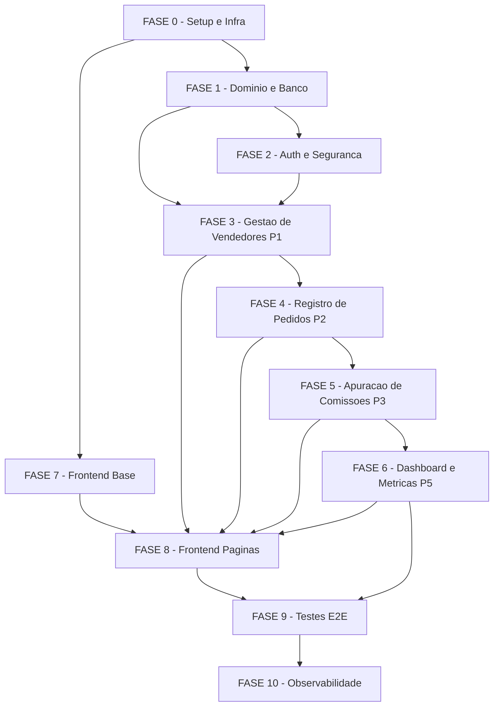

# Tarefas: Financial Dashboard

**Feature**: `financial-dashboard`
**Criado**: 2026-06-03
**Gerado por**: agente-00c, onda-007 (etapa create-tasks, modo autonomo)
**Predecessor**: spec.md (Clarified, 29 FRs, 5 User Stories P1-P5) | plan.md | checklists/ (5 dominios, 41 gaps)
**Constitution**: P-I Auditabilidade, P-II Integridade do Calculo, P-III Precisao Monetaria (todos NON-NEGOTIABLE), P-IV RBAC Deny-by-Default, P-V LGPD
**Stack**: Go 1.22 + chi v5 + pgx/v5 + golang-migrate | React 18 + Vite + TS + recharts + zod | PostgreSQL 16

---

**Legenda de status:**
- `[ ]` Pendente
- `[x]` Concluido
- `[~]` Em progresso
- `[!]` Bloqueado

**Legenda de criticidade:**
- `[C]` Critico — impacto financeiro, regulatorio ou de seguranca direto; bloqueia outras tasks
- `[A]` Alto — funcionalidade core sem a qual o sistema nao opera
- `[M]` Medio — necessario mas pode ser adiado sem impacto imediato

---

## FASE 0 — Setup e Infraestrutura

> Prerequisito absoluto de todas as fases. Sem estrutura de projeto, migrations e CI rodando, nenhuma feature pode ser implementada.

### 0.1 Inicializar repositorio e modulo Go `[C]`

Ref: plan.md §Project Structure; constitution §stack fixada

- [x] 0.1.1 Criar estrutura de diretorios: `backend/cmd/api/`, `backend/internal/{domain,repository,service,http,auth,dto}/`, `backend/migrations/`
- [x] 0.1.2 Inicializar Go module (`go mod init`) e adicionar dependencias: `chi v5`, `pgx/v5`, `golang-migrate`, `shopspring/decimal`, `golang-jwt/jwt/v5`, `testify`
- [x] 0.1.3 Criar `backend/cmd/api/main.go` com entrypoint HTTP (chi router, porta configuravel via env)
- [x] 0.1.4 Criar arquivo `.env.example` com variaveis obrigatorias: `DATABASE_URL`, `JWT_SECRET`, `JWT_ACCESS_TTL`, `JWT_REFRESH_TTL`, `SERVER_PORT`
- [x] 0.1.5 Verificar que `go build ./...` e `go vet ./...` executam sem erros

### 0.2 Inicializar projeto frontend `[C]`

Ref: plan.md §Project Structure; research dec-032

- [x] 0.2.1 Criar projeto Vite + React 18 + TypeScript em `web/` (`npm create vite@latest web -- --template react-ts`)
- [x] 0.2.2 Instalar dependencias: `@tanstack/react-query`, `recharts`, `zod`, `react-router-dom`
- [x] 0.2.3 Criar estrutura de diretorios: `web/src/{types,api,pages,components}/`
- [x] 0.2.4 Configurar `web/src/types/` com arquivo de barrel index e estrutura base camelCase
- [x] 0.2.5 Verificar que `npm run build` executa sem erros

### 0.3 Configurar PostgreSQL e migrations `[C]`

Ref: plan.md §Technical Context; data-model.md; quickstart.md

- [x] 0.3.1 Criar `docker-compose.yml` com servico PostgreSQL 16 (porta 5433, volume persistente, variaveis de env)
- [x] 0.3.2 Configurar `golang-migrate` com diretorio `backend/migrations/` e makefile targets (`migrate-up`, `migrate-down`, `migrate-create`)
- [x] 0.3.3 Criar migration `001_initial_schema.sql` com extensao pgcrypto e funcao fn_prevent_mutation (trilha append-only P-I)
- [x] 0.3.4 Verificar que `make migrate-up` executa sem erros contra instancia local

### 0.4 Configurar ambiente de testes `[C]`

Ref: quickstart.md §7 Testes; plan.md §Technical Context

- [x] 0.4.1 Criar `backend/Makefile` com targets: `test` (go test ./...), `test-integration` (com DB real), `lint` (staticcheck/golangci-lint)
- [x] 0.4.2 Instalar Playwright no diretorio `e2e/` (via npm install @playwright/test)
- [x] 0.4.3 Criar `e2e/` com estrutura base: `playwright.config.ts`, `fixtures/`, `tests/`
- [x] 0.4.4 Criar script de seed de dados para testes (`backend/testdata/seed.sql`)
- [x] 0.4.5 Verificar que `go test ./...` e `npm run build` executam sem erros

### 0.5 Gaps de checklist: definicoes pre-implementacao `[C]`

Ref: checklists/security.md CHK002/CHK004/CHK010/CHK019/CHK020; checklists/compliance.md CHK063/CHK069/CHK077/CHK078; dec-037/dec-038

> Estes gaps foram identificados nos checklists como decisoes tecnicas necessarias ANTES de implementar. Sao resolvidos aqui como subtarefas de especificacao/documentacao, nao de codigo.

- [x] 0.5.1 Definir TTLs de JWT: `access_token=15min`, `refresh_token=7dias` — documentado em `quickstart.md §Auth` e `.env.example` (CHK002)
- [x] 0.5.2 Definir algoritmo de hash de senha: Argon2id com m=64MB, t=3, p=4 (preferido) ou bcrypt cost=12 (fallback) — documentado em `quickstart.md §Auth` (CHK004)
- [x] 0.5.3 Definir comportamento de token expirado: HTTP 401 com `{"error":"token_expired","message":"...","refreshUrl":"/auth/refresh"}` — documentado em `quickstart.md §Auth` (CHK010)
- [x] 0.5.4 Definir limites de texto: `vendors.name` <= 200 chars, `orders.description` <= 500 chars, `order_items.description` <= 200 chars — documentado em `quickstart.md §Auth` (CHK019)
- [x] 0.5.5 Definir formato de anonimizacao LGPD: `name` -> `"REMOVED_<uuid>"`, `email` -> `"removed_<sha256[:8]>@anon.invalid"` — documentado em `quickstart.md §Auth` (CHK014)
- [x] 0.5.6 Definir ator autorizado para exclusao LGPD: apenas Gestor/Admin via `DELETE /api/v1/vendors/{id}` com `{"confirm":true}` — documentado em `quickstart.md §Auth` (CHK077)
- [x] 0.5.7 Definir trilha de operacao LGPD: `audit_trail` com `entity_type='vendor_anonymization'` — documentado em `quickstart.md §Auth` (CHK078)
- [x] 0.5.8 Confirmar que `audit_trail` registra `commission_rule` — criterio de aceite documentado em `quickstart.md §Auth` (CHK069)
- [x] 0.5.9 Definir criterio de aceite SC-007: query `information_schema.columns` — documentado em `quickstart.md §Testes Conformidade SC-007` (CHK063)
- [x] 0.5.10 Definir sanitizacao de input: bind params pgx + allowlist explicita de PATCH — documentado em `quickstart.md §Auth` (CHK020)

---

## FASE 1 — Dominio e Banco de Dados

> Entidades puras, maquinas de estado, migrations completas e primitivas de dinheiro. Pre-requisito de toda a camada de backend.

### 1.1 Primitivas monetarias: `money.go` `[C]`

Ref: spec §FR-007; plan §P-III; research dec-024/dec-025; constitution P-III NON-NEGOTIABLE

- [x] 1.1.1 Criar `backend/internal/domain/money.go` com tipo `Money int64` representando centavos
- [x] 1.1.2 Implementar `money.RoundCommission(orderCents int64, percentage decimal.Decimal) int64` com arredondamento half-up (shopspring/decimal) — unico ponto de arredondamento no sistema
- [x] 1.1.3 Implementar helpers: `MoneyFromCents(int64) Money`, `ToCents() int64`, `String() string` (formato "R$ X,XX" para exibicao)
- [x] 1.1.4 Escrever testes unitarios: calcular 8% de R$5.000,00 = R$400,00 exatos; calcular 10% de R$1.000,00 = R$100,00; verificar que resultado e identico em 100% das execucoes (SC-002)
- [x] 1.1.5 Escrever teste de propriedade: arredondamento half-up nao usa float em nenhum ponto intermediario (verificar com `go vet` e inspecao de tipos)

### 1.2 Maquina de estado: Pedido `[C]`

Ref: spec §FR-008, US2; plan §domain/order.go; dec-019

- [x] 1.2.1 Criar `backend/internal/domain/order.go` com enum `OrderStatus` (rascunho, confirmado, pago, cancelado)
- [x] 1.2.2 Implementar `(s OrderStatus) Transition(to OrderStatus) error` validando as 4 transicoes validas: rascunho→confirmado, confirmado→pago, confirmado→cancelado, pago→cancelado
- [x] 1.2.3 Garantir que todas as demais transicoes retornam `ErrInvalidTransition` (rejeitadas explicitamente — FR-008)
- [x] 1.2.4 Escrever testes unitarios para cada transicao valida e para >=5 transicoes invalidas (ex: pago→rascunho, cancelado→confirmado)
- [x] 1.2.5 Escrever teste para a regra de negocio: `pago→cancelado` retorna flag `RequiresReversalCheck=true` para sinalizar o service

### 1.3 Maquina de estado: Comissao/Pagamento `[C]`

Ref: spec §FR-020, US4; plan §domain/commission.go; dec-019/dec-021

- [x] 1.3.1 Criar `backend/internal/domain/commission.go` com enum `CommissionStatus` (pendente, aprovado, pago)
- [x] 1.3.2 Implementar transicoes: pendente→aprovado, aprovado→pago, aprovado→pendente (com motivo obrigatorio)
- [x] 1.3.3 Criar enum `ReversalStatus` (aplicado, pendente_aprovacao, aprovado, lancado) para Estorno (FR-027/FR-028)
- [x] 1.3.4 Implementar logica de bifurcacao do estorno: comissao `pendente` → estorno `aplicado`; comissao `aprovado`/`pago` → estorno `pendente_aprovacao` (FR-028)
- [x] 1.3.5 Escrever testes unitarios para cada transicao valida, invalida e para a logica de bifurcacao do estorno

### 1.4 Migrations: schema completo `[C]`

Ref: data-model.md (schema completo); plan §P-I/P-II/P-III; constitution P-III NON-NEGOTIABLE

- [x] 1.4.1 Criar migration `002_users.sql`: tabela `users` com `id UUID PK`, `name VARCHAR(200)`, `email VARCHAR(255) UNIQUE`, `password_hash TEXT NOT NULL`, `role CHECK IN ('gestor','vendedor','financeiro')`, `vendor_id FK nullable`, `CHECK (role='vendedor') = (vendor_id IS NOT NULL)`
- [x] 1.4.2 Criar migration `003_vendors.sql`: tabela `vendors` com `id UUID PK`, `name VARCHAR(200) NOT NULL`, `email VARCHAR(255) UNIQUE NOT NULL`, `status CHECK IN ('ativo','inativo')`, `anonymized_at TIMESTAMPTZ NULL`
- [x] 1.4.3 Criar migration `004_commission_rules.sql`: tabela `commission_rules` com `id UUID PK`, `vendor_id FK`, `percentage NUMERIC(7,4) CHECK [0,100]`, `valid_from DATE NOT NULL`, `valid_to DATE NULL`, `version INTEGER NOT NULL`; trigger BEFORE UPDATE OR DELETE → RAISE EXCEPTION (imutabilidade P-I)
- [x] 1.4.4 Criar migration `005_orders.sql`: tabela `orders` com `id UUID PK`, `vendor_id FK`, `total_cents BIGINT NOT NULL CHECK >= 0`, `order_date DATE NOT NULL`, `status VARCHAR(20)`, `paid_at TIMESTAMPTZ NULL`; tabela `order_items` com `id UUID PK`, `order_id FK`, `description VARCHAR(500)`, `quantity INTEGER`, `unit_price_cents BIGINT CHECK >= 0`, `line_total_cents BIGINT CHECK >= 0`
- [x] 1.4.5 Criar migration `006_commissions.sql`: tabela `commissions` com `id UUID PK`, `order_id FK UNIQUE` (garante idempotencia FR-014), `vendor_id FK`, `value_cents BIGINT NOT NULL CHECK >= 0`, `applied_percentage NUMERIC(7,4)`, `rule_id FK`, `period_year INTEGER`, `period_month INTEGER`, `status VARCHAR(20)`, `calculated_at TIMESTAMPTZ`; trigger BEFORE UPDATE OR DELETE → RAISE EXCEPTION
- [x] 1.4.6 Criar migration `007_commission_reversals.sql`: tabela `commission_reversals` com `id UUID PK`, `commission_id FK`, `order_id FK`, `value_cents BIGINT NOT NULL CHECK <= 0`, `status VARCHAR(30)`, `created_at TIMESTAMPTZ`, `actor_user_id FK`; trigger BEFORE UPDATE OR DELETE → RAISE EXCEPTION (P-I)
- [x] 1.4.7 Criar migration `008_audit_trail.sql`: tabela `audit_trail` com `id UUID PK`, `entity_type VARCHAR(50)`, `entity_id UUID`, `actor_user_id FK`, `occurred_at TIMESTAMPTZ DEFAULT NOW()`, `from_state VARCHAR(50)`, `to_state VARCHAR(50)`, `reason TEXT`, `metadata JSONB`; trigger BEFORE UPDATE OR DELETE → RAISE EXCEPTION
- [x] 1.4.8 Criar migration `009_views.sql`: view `commission_net_balance` com SQL: `SELECT c.id, c.vendor_id, c.value_cents + COALESCE(SUM(cr.value_cents),0) AS net_cents FROM commissions c LEFT JOIN commission_reversals cr ON cr.commission_id = c.id GROUP BY c.id, c.vendor_id`
- [x] 1.4.9 Criar indices de performance: `(vendor_id, order_date)` em orders; `(vendor_id, period_year, period_month)` em commissions; `(entity_type, entity_id)` em audit_trail
- [x] 1.4.10 Verificar SC-007: executar query contra `information_schema.columns` confirmando ausencia de colunas com `data_type IN ('real','double precision','float4','float8')`
- [x] 1.4.11 Escrever teste de schema automatizado (Go test) que varre `information_schema.columns` e falha se qualquer coluna monetaria for float — criterio de aceite SC-007/CHK063

---

## FASE 2 — Backend: Autenticacao e Seguranca `[C]`

> Auth/JWT e blocklist sao prerequisito de TODOS os endpoints. Implementado antes de qualquer feature de negocio.

### 2.1 Servico de autenticacao (auth.go) `[C]`

Ref: spec §FR-024, FR-025, FR-026; plan §auth/; research dec-026; checklists CHK001/CHK004/CHK011/CHK025/CHK026

- [x] 2.1.1 Criar `backend/internal/auth/auth.go` com funcoes: `HashPassword(plain string) (string, error)` usando Argon2id (m=64MB, t=3, p=4) e `VerifyPassword(plain, hash string) bool`
- [x] 2.1.2 Implementar `IssueAccessToken(userID, role, vendorID string) (string, error)` com HS256, claims `sub/role/vendor_id/exp`, TTL=15min (`JWT_ACCESS_TTL` do env)
- [x] 2.1.3 Implementar `IssueRefreshToken(userID string) (string, error)` com TTL=7dias (`JWT_REFRESH_TTL` do env)
- [x] 2.1.4 Implementar `VerifyToken(tokenString string) (*Claims, error)` com validacao de algoritmo (pinnar `alg=HS256`, rejeitar outros — dec-034 owasp finding)
- [x] 2.1.5 Escrever testes: hash/verify senha; emitir/verificar token valido; rejeitar token expirado (401); rejeitar token com alg diferente; verificar que claims contem sub/role/vendor_id

### 2.2 Blocklist de tokens revogados `[C]`

Ref: checklists/security.md CHK011; dec-037 (risco medio/alto); FR-001 (desativacao de vendedor)

> CHK011: JWT stateless nao tem revogacao nativa. Task dedicada obrigatoria antes de qualquer endpoint autenticado.

- [x] 2.2.1 Criar migration `010_token_blocklist.sql`: tabela `token_blocklist` com `jti UUID PK`, `expires_at TIMESTAMPTZ`, `revoked_at TIMESTAMPTZ DEFAULT NOW()`, `reason VARCHAR(100)`; indice em `expires_at` para cleanup periodico
- [x] 2.2.2 Criar `backend/internal/auth/blocklist.go` com interface `TokenBlocklist` e implementacao `DBBlocklist` (pgx)
- [x] 2.2.3 Implementar `Revoke(jti string, expiresAt time.Time, reason string) error` — insere na tabela
- [x] 2.2.4 Implementar `IsRevoked(jti string) (bool, error)` — verifica na tabela; integrar em `VerifyToken` (verificar blocklist apos validar assinatura)
- [x] 2.2.5 Adicionar claim `jti` (JWT ID uuid) a todo token emitido — necessario para revogar individualmente
- [x] 2.2.6 Escrever testes: revogar token e verificar que IsRevoked retorna true; verificar que token nao-revogado passa; verificar que desativacao de vendedor revoga token ativo

### 2.3 Middleware de autenticacao e RBAC `[C]`

Ref: spec §FR-025, FR-026; plan §http/; constitution P-IV RBAC deny-by-default

- [x] 2.3.1 Criar `backend/internal/http/middleware/auth.go` com `RequireAuth` — extrai JWT do header `Authorization: Bearer`, verifica assinatura + expiracao + blocklist; retorna 401 se invalido
- [x] 2.3.2 Implementar response padrao para token expirado: `HTTP 401 {"error":"token_expired","message":"...","refreshUrl":"/api/v1/auth/refresh"}` (CHK010)
- [x] 2.3.3 Criar `RequireRole(roles ...string)` — verifica claim `role` contra lista; retorna 403 se papel nao autorizado
- [x] 2.3.4 Criar `RequireVendorScope` — para endpoints de vendedor: verifica que `vendor_id` do token == `vendor_id` do recurso (re-validacao server-side contra BOLA/IDOR — dec-034 owasp, SC-005)
- [x] 2.3.5 Escrever testes de middleware: request sem token → 401; token invalido → 401; token expirado → 401 com refreshUrl; papel errado → 403; vendedor tentando acessar recurso de outro → 403
- [x] 2.3.6 Escrever teste negativo por endpoint: verificar que CADA endpoint critico retorna 403 quando Vendedor tenta acessar dados de outro vendedor (SC-005)

### 2.4 Handlers de autenticacao `[A]`

Ref: spec §FR-024; contracts/api.md §/auth; checklists CHK025/CHK026

- [x] 2.4.1 Criar `POST /api/v1/auth/login`: valida credenciais, emite access_token + refresh_token; armazenar refresh em httpOnly cookie (CHK026 — nunca em localStorage)
- [x] 2.4.2 Criar `POST /api/v1/auth/refresh`: valida refresh_token (nao revogado), emite novo access_token; revogar refresh_token anterior (rotacao)
- [x] 2.4.3 Criar `POST /api/v1/auth/logout`: revoga access_token e refresh_token ativos (insere na blocklist)
- [x] 2.4.4 Implementar rate-limit em `/auth/login`: max 5 tentativas por IP em 60s (CHK — dec-034 owasp finding medium)
- [x] 2.4.5 Garantir que JWT e retornado APENAS em response JSON (access_token) e em httpOnly cookie (refresh_token) — nunca exposto em URL, log ou body sem restricao
- [x] 2.4.6 Escrever testes de integracao: login com credenciais corretas → 200 + tokens; login incorreto 5x → 429; refresh com token valido → novo token; logout → token revogado

### 2.5 Configuracao TLS/HTTPS `[C]`

Ref: checklists/security.md CHK025; dec-037 (risco alto); quickstart.md §Deploy

> CHK025: HTTPS obrigatorio antes de qualquer dado trafegar.

- [x] 2.5.1 Configurar suporte a TLS em `main.go`: se `TLS_CERT_PATH` e `TLS_KEY_PATH` definidos no env, usar `http.ListenAndServeTLS`; senao, HTTP (para dev local)
- [x] 2.5.2 Atualizar `docker-compose.yml` com servico de reverse proxy (nginx ou traefik) configurado para TLS (certificado auto-assinado para dev, Let's Encrypt para producao)
- [x] 2.5.3 Documentar em `quickstart.md §Deploy` a configuracao de TLS para producao e a instrucao de never-expose-HTTP
- [x] 2.5.4 Escrever teste de smoke: servidor iniciado com TLS responde a request HTTPS sem erro de certificado (usando certificado de teste)

---

## FASE 3 — Backend: Gestao de Vendedores (P1)

> Fundacao do sistema. Sem vendedores cadastrados, nenhuma outra funcionalidade opera.

### 3.1 Repository de vendedores `[A]`

Ref: spec §FR-001, FR-002, FR-003, FR-004, FR-005; data-model.md §Vendor; plan §repository/

- [x] 3.1.1 Criar `backend/internal/repository/vendor_repository.go` com interface `VendorRepository` e implementacao `PGVendorRepository` (pgx/v5)
- [x] 3.1.2 Implementar `Create(ctx, vendor Vendor) (Vendor, error)` com INSERT retornando UUID gerado
- [x] 3.1.3 Implementar `FindByID(ctx, id UUID) (Vendor, error)` — retorna `ErrNotFound` se ausente
- [x] 3.1.4 Implementar `List(ctx, filter VendorFilter) ([]Vendor, error)` com filtro por status (ativo/inativo); usar bind params (nao interpolacao SQL — CHK020 owasp)
- [x] 3.1.5 Implementar `Update(ctx, id UUID, patch VendorPatch) (Vendor, error)` com allowlist explicita de campos mutaveis: apenas `name`, `email`, `status` (CHK020 mass-assign protection — dec-034 owasp)
- [x] 3.1.6 Implementar `Anonymize(ctx, id UUID, actorID UUID) error` — anonimiza PII + grava em `audit_trail` com `entity_type='vendor_anonymization'` (CHK077/CHK078 LGPD)
- [x] 3.1.7 Criar `backend/internal/repository/mapper.go` com funcoes snake_case ↔ camelCase para Vendor (mapeamento inline no repository — sem arquivo separado necessario)

### 3.2 Repository de regras de comissao `[C]`

Ref: spec §FR-002, FR-003, FR-012; data-model.md §CommissionRule; plan §repository/

- [x] 3.2.1 Criar `backend/internal/repository/commission_rule_repository.go` com interface `CommissionRuleRepository`
- [x] 3.2.2 Implementar `CreateRule(ctx, vendorID UUID, percentage decimal.Decimal) (CommissionRule, error)` — cierra a regra anterior (`valid_to = NOW()`) e cria nova versao em UNICA transacao (FR-003)
- [x] 3.2.3 Implementar `FindActiveAtDate(ctx, vendorID UUID, date time.Time) (CommissionRule, error)` — selecao por `valid_from <= date AND (valid_to IS NULL OR valid_to > date)` (FR-012, dec-020/dec-027)
- [x] 3.2.4 Implementar `ListByVendor(ctx, vendorID UUID) ([]CommissionRule, error)` — historico completo de versoes (auditoria FR-003)
- [x] 3.2.5 Escrever testes de integracao: criar 3 versoes de regra; verificar que `FindActiveAtDate` seleciona a correta pela data; verificar que regra anterior fica imutavel (trigger bloqueia UPDATE)

### 3.3 Service de vendedores `[A]`

Ref: spec §FR-001..FR-005; constitution P-IV RBAC, P-V LGPD

- [x] 3.3.1 Criar `backend/internal/service/vendor_service.go` com `VendorService` (injeta repositorios via interface)
- [x] 3.3.2 Implementar `CreateVendor(ctx, req CreateVendorReq, actorRole string) (Vendor, error)` — validar papel (apenas Gestor), criar vendedor + regra de comissao inicial
- [x] 3.3.3 Implementar `UpdateVendor(ctx, id UUID, patch VendorPatch, actorRole string) (Vendor, error)` — validar papel; se percentual muda, criar nova versao de regra (FR-003)
- [x] 3.3.4 Implementar `DeactivateVendor(ctx, id UUID, actorRole string) error` — marcar status='inativo'; revogar tokens ativos do vendedor (CHK011 — integrar com blocklist)
- [x] 3.3.5 Implementar `AnonymizeVendor(ctx, id UUID, actorUserID UUID, actorRole string) error` — apenas Gestor; chamar `Anonymize` do repository
- [x] 3.3.6 Escrever testes unitarios: criar vendedor com mock de repository; Vendedor tentando criar → erro de RBAC; percentual invalido (>100, negativo) → erro de validacao; desativar → revogar token

### 3.4 Handlers HTTP de vendedores `[A]`

Ref: spec §FR-001..FR-005; contracts/api.md §/vendors; plan §http/

- [x] 3.4.1 Criar `backend/internal/http/vendor_handler.go` com chi router para: `GET /api/v1/vendors`, `POST /api/v1/vendors`, `GET /api/v1/vendors/{id}`, `PATCH /api/v1/vendors/{id}`, `DELETE /api/v1/vendors/{id}` (anonimizacao LGPD)
- [x] 3.4.2 Aplicar middlewares: `RequireAuth` + `RequireRole("gestor","financeiro")` nas listas; `RequireRole("gestor")` em escrita/exclusao
- [x] 3.4.3 Implementar bind de request JSON para DTOs, validacao de campos (FR-002: range percentual), retorno de erros estruturados
- [x] 3.4.4 Implementar resposta camelCase: mapper DTO → response JSON (`backend/internal/dto/vendor.go`)
- [x] 3.4.5 Escrever testes de integracao HTTP: POST /vendors com Gestor → 201; POST com Vendedor → 403; GET /vendors/{id} com Gestor → 200; GET /vendors/{outro-id} com Vendedor → 403 (SC-005); DELETE /vendors/{id} → 204 + verificar anonimizacao

---

## FASE 4 — Backend: Registro de Pedidos (P2)

> Pedidos sao a materia-prima do calculo de comissao. Depende de FASE 3 (vendedores existentes).

### 4.1 Repository de pedidos `[A]`

Ref: spec §FR-006..FR-010; data-model.md §Order; plan §repository/

- [x] 4.1.1 Criar `backend/internal/repository/order_repository.go` com interface `OrderRepository`
- [x] 4.1.2 Implementar `Create(ctx, order CreateOrderReq) (Order, error)` com status inicial `rascunho`, valor em centavos
- [x] 4.1.3 Implementar `FindByID(ctx, id UUID) (Order, error)` com items de linha (JOIN order_items)
- [x] 4.1.4 Implementar `List(ctx, filter OrderFilter) ([]Order, error)` com filtros: `vendor_id`, `status`, `period` (mes/ano) — bind params (CHK020 owasp)
- [x] 4.1.5 Implementar `Transition(ctx, id UUID, to OrderStatus, actorID UUID) (Order, error)` em UNICA transacao: UPDATE status + INSERT audit_trail (FR-009); chamar `order.Transition()` do dominio para validar; retornar `ErrInvalidTransition` se invalido
- [x] 4.1.6 Escrever testes de integracao: criar pedido; transicionar rascunho→confirmado→pago; tentar pago→rascunho → erro; verificar audit_trail com 2 registros

### 4.2 Service de pedidos `[C]`

Ref: spec §FR-006..FR-010, FR-027, FR-028; constitution P-I, P-II; dec-038 CHK081

- [x] 4.2.1 Criar `backend/internal/service/order_service.go` com `OrderService`
- [x] 4.2.2 Implementar `CreateOrder(ctx, req CreateOrderReq, actorRole string) (Order, error)` — validar papel (Gestor), validar valor (nao-negativo, sem float), criar pedido
- [x] 4.2.3 Implementar `TransitionOrder(ctx, id UUID, to OrderStatus, actorUserID UUID, actorRole string) (Order, error)` — validar RBAC; chamar repository.Transition; se transicao for `pago→cancelado`, chamar `createReversal` na mesma transacao (CHK081 — atomicidade)
- [x] 4.2.4 Implementar `createReversal(ctx, tx pgx.Tx, orderID UUID, actorID UUID) error` — OBRIGATORIO na mesma transacao do cancelamento: buscar comissoes do pedido, criar estorno para cada uma com logica de bifurcacao (FR-028), gravar audit_trail (CHK081/dec-038)
- [x] 4.2.5 **Criterio de aceite CHK081**: ao simular crash entre cancelamento e criacao de estorno (tx.Rollback forcado), verificar que NENHUM estado inconsistente e persistido (pedido cancelado sem estorno)
- [x] 4.2.6 Escrever testes unitarios: cancelar pedido pago com comissao `pendente` → estorno `aplicado`; cancelar com comissao `aprovado` → estorno `pendente_aprovacao`; cancelar sem comissao → sem estorno (nao errar)

### 4.3 Handlers HTTP de pedidos `[A]`

Ref: spec §FR-006..FR-010; contracts/api.md §/orders; plan §http/

- [x] 4.3.1 Criar `backend/internal/http/order_handler.go` com chi router: `GET /api/v1/orders`, `POST /api/v1/orders`, `GET /api/v1/orders/{id}`, `PATCH /api/v1/orders/{id}/status`
- [x] 4.3.2 Aplicar middlewares: `RequireAuth` + `RequireRole("gestor")` em escrita; Financeiro e Vendedor podem ler (com escopo)
- [x] 4.3.3 Implementar DTOs de pedido com valor monetario como inteiro de centavos (`totalCents int64`) — nunca float (P-III)
- [x] 4.3.4 Escrever testes de integracao HTTP: POST /orders → 201; PATCH /orders/{id}/status → 200; Vendedor acessando pedido de outro → 403

---

## FASE 5 — Backend: Apuracao de Comissoes (P3)

> Core financeiro do sistema. Depende de FASE 3 (vendedores) e FASE 4 (pedidos pagos).

### 5.1 Repository de comissoes `[C]`

Ref: spec §FR-011..FR-015; data-model.md §Commission; plan §repository/; constitution P-I, P-II

- [x] 5.1.1 Criar `backend/internal/repository/commission_repository.go` com interface `CommissionRepository`
- [x] 5.1.2 Implementar `CreateBatch(ctx, tx pgx.Tx, commissions []Commission) ([]Commission, int, error)` — INSERT em batch com `ON CONFLICT (order_id) DO NOTHING`; retornar contagem de inseridos e de pulados (idempotencia FR-014)
- [x] 5.1.3 Implementar `FindByPeriod(ctx, filter CommissionFilter) ([]Commission, error)` com filtros: `vendor_id`, `period_year`, `period_month`, `status`; usar view `commission_net_balance` para saldo liquido
- [x] 5.1.4 Implementar `Transition(ctx, id UUID, to CommissionStatus, actorID UUID, motivo string) (Commission, error)` em UNICA transacao com INSERT audit_trail
- [x] 5.1.5 Escrever testes de integracao: inserir 3 comissoes; re-inserir as mesmas → 0 novas (idempotencia SC-003); verificar `commission_net_balance` com estorno

### 5.2 Service de apuracao `[C]`

Ref: spec §FR-011..FR-015; constitution P-II NON-NEGOTIABLE; dec-038 CHK073; research dec-025/dec-028

- [x] 5.2.1 Criar `backend/internal/service/apuration_service.go` com `ApurationService`
- [x] 5.2.2 Implementar `ApurateMonth(ctx, year, month int, actorRole string) (ApurationResult, error)` com UNICA transacao para toda a apuracao (CHK073 — atomicidade tudo-ou-nada; dec-038)
- [x] 5.2.3 Dentro da transacao: (1) buscar todos os pedidos `pago` do periodo; (2) para cada pedido, buscar `commission_rule` vigente na `order_date` (FR-012); (3) calcular `money.RoundCommission()` (P-III); (4) `CreateBatch` com `ON CONFLICT DO NOTHING` (FR-014)
- [x] 5.2.4 Retornar `ApurationResult`: total de comissoes calculadas, total de centavos, total de puladas por idempotencia, periodo apurado
- [x] 5.2.5 **Criterio de aceite CHK073**: ao simular falha no meio da apuracao (tx.Rollback forcado apos processar 50%), verificar que nenhuma comissao parcial e persistida; reexecutar → apuracao completa sem duplicatas
- [x] 5.2.6 Escrever testes: 1 vendedor 8% + 2 pedidos (R$2000 + R$3000) → comissao R$400 exatos (US3.1); reprocessar → 0 duplicatas (SC-003); pedido `confirmado` nao entra (FR-011); percentual na data do pedido (US3.4)

### 5.3 Handlers HTTP de apuracao e comissoes `[A]`

Ref: spec §FR-015, FR-020..FR-023; contracts/api.md §/commissions; plan §http/

- [x] 5.3.1 Criar `POST /api/v1/commissions/apurate` com body `{"year":2026,"month":6}` — apenas Gestor; retornar `ApurationResult`
- [x] 5.3.2 Criar `GET /api/v1/commissions` com filtros `vendorId`, `year`, `month`, `status` — Gestor ve tudo; Vendedor ve apenas as suas (escopo via `RequireVendorScope` — SC-005)
- [x] 5.3.3 Criar `PATCH /api/v1/commissions/{id}/status` — apenas Financeiro; transicoes: pendente→aprovado, aprovado→pago, aprovado→pendente (com motivo)
- [x] 5.3.4 Criar `GET /api/v1/commissions/{id}` — Gestor e Financeiro veem tudo; Vendedor ve somente suas (RBAC P-IV)
- [x] 5.3.5 Escrever testes HTTP: apurar periodo → 200 com resultado; Vendedor tentando apurar → 403; Vendedor listando comissoes → somente as suas; Financeiro aprovando comissao → 200

---

## FASE 6 — Backend: Dashboard e Metricas (P5)

> Derivado dos dados financeiros. Depende de FASE 3, 4, 5 completos.

### 6.1 Repository de dashboard `[M]`

Ref: spec §FR-016..FR-019; data-model.md §Views; plan §repository/; constitution P-I (derivado deterministico)

- [x] 6.1.1 Criar `backend/internal/repository/dashboard_repository.go` com interface `DashboardRepository`
- [x] 6.1.2 Implementar `GetConsolidated(ctx, filter DashboardFilter) (ConsolidatedDashboard, error)` — query com bind params (CHK020 owasp SQL injection — dec-034): total de vendas (SUM pedidos pagos), total de comissoes, ranking por volume
- [x] 6.1.3 Implementar `GetVendorDashboard(ctx, vendorID UUID, filter DashboardFilter) (VendorDashboard, error)` — filtra por vendor_id; escopo de vendedor garantido no service
- [x] 6.1.4 Implementar `GetDrillDown(ctx, orderID UUID) (DrillDown, error)` — retorna pedido + comissoes + estornos para rastreabilidade SC-004
- [x] 6.1.5 Escrever testes de integracao: dashboard com dados fixos → totais corretos e identicos em execucoes repetidas (SC-002); drill-down retorna rastreabilidade ate pedido individual (SC-004)

### 6.2 Service e handlers de dashboard `[M]`

Ref: spec §FR-016..FR-019, SC-009; contracts/api.md §/dashboard; plan §http/

- [x] 6.2.1 Criar `backend/internal/service/dashboard_service.go` — aplicar escopo: Gestor ve todos os vendedores; Vendedor ve apenas os proprios (P-IV)
- [x] 6.2.2 Criar `GET /api/v1/dashboard/consolidated` com filtros `year`, `month` (ou `startDate`/`endDate`) — apenas Gestor e Financeiro
- [x] 6.2.3 Criar `GET /api/v1/dashboard/vendor` — Vendedor ve apenas os proprios; Gestor pode filtrar por `vendorId`
- [x] 6.2.4 Criar `GET /api/v1/dashboard/commissions/pending` — indicadores de comissoes pendentes de aprovacao e pagamento (FR-019) — Gestor e Financeiro
- [x] 6.2.5 Criar `GET /api/v1/orders/{id}/drilldown` — rastreabilidade valor → pedidos individuais (SC-004, P-I)
- [x] 6.2.6 Escrever testes HTTP + performance: dashboard com 10.000 pedidos carrega em < 3s (SC-009); Vendedor acessando dashboard consolidado → 403

---

## FASE 7 — Frontend: Tipos, API Client e Base (P1/P2/P3)

> Fundacao do frontend. Tipos TypeScript + schemas zod + hooks react-query para todas as entidades.

### 7.1 Tipos TypeScript e schemas Zod `[A]`

Ref: plan §Convencoes de Borda; contracts/api.md; spec §FR-007 (centavos); dec-032

- [ ] 7.1.1 Criar `web/src/types/vendor.ts`: interface `Vendor`, `CreateVendorRequest`, `VendorPatch`, `CommissionRule` — campos camelCase, percentual como `string` ("5.5000")
- [ ] 7.1.2 Criar `web/src/types/order.ts`: interface `Order`, `OrderItem`, `CreateOrderRequest` — `totalCents: number` (inteiro), nunca float (P-III)
- [ ] 7.1.3 Criar `web/src/types/commission.ts`: interface `Commission`, `CommissionReversal`, `ApurationRequest`, `ApurationResult`, `CommissionNetBalance`
- [ ] 7.1.4 Criar `web/src/types/dashboard.ts`: interface `ConsolidatedDashboard`, `VendorDashboard`, `DrillDown`
- [ ] 7.1.5 Criar schemas Zod correspondentes em `web/src/types/*.schema.ts` — parse em toda resposta da API (borda de validacao)
- [ ] 7.1.6 Criar `web/src/types/index.ts` barrel com todos os exports
- [ ] 7.1.7 Verificar paridade EXATA com contracts/api.md: cada campo do contrato deve ter correspondente no schema Zod (diff manual + teste smoke)

### 7.2 API client com react-query `[A]`

Ref: plan §Technical Context; contracts/api.md; research dec-032

- [ ] 7.2.1 Criar `web/src/api/client.ts` com `fetchJSON<T>(url, options): Promise<T>` — faz fetch, verifica status, faz zod.parse na resposta (CHK026: envia access_token como Bearer header, refresh_token nunca tocado no JS — httpOnly cookie)
- [ ] 7.2.2 Criar `web/src/api/vendors.ts` com hooks: `useVendors()`, `useVendor(id)`, `useCreateVendor()`, `useUpdateVendor()`, `useDeactivateVendor()`
- [ ] 7.2.3 Criar `web/src/api/orders.ts` com hooks: `useOrders(filter)`, `useOrder(id)`, `useCreateOrder()`, `useTransitionOrder()`
- [ ] 7.2.4 Criar `web/src/api/commissions.ts` com hooks: `useCommissions(filter)`, `useApurate()`, `useTransitionCommission()`
- [ ] 7.2.5 Criar `web/src/api/dashboard.ts` com hooks: `useConsolidatedDashboard(filter)`, `useVendorDashboard(filter)`, `usePendingCommissions()`
- [ ] 7.2.6 Criar `web/src/api/auth.ts` com: `useLogin()`, `useLogout()`, `useRefreshToken()` (renovacao automatica via interceptor react-query)
- [ ] 7.2.7 Escrever testes vitest: mock de fetch; verificar que zod.parse rejeita resposta malformada; verificar que token e enviado como Bearer header

---

## FASE 8 — Frontend: Paginas e Componentes (P1-P5)

> Interface do usuario. Depende de FASE 7 (tipos e API client completos).

### 8.1 Layout base e autenticacao `[A]`

Ref: spec §US1..US5; contracts/api.md §Auth; plan §pages/

- [ ] 8.1.1 Criar `web/src/pages/Login.tsx` — formulario de login com validacao Zod; chamar `useLogin()`; redirecionar apos sucesso
- [ ] 8.1.2 Criar `web/src/components/Layout.tsx` — navbar com papel do usuario, menu por papel (Gestor: tudo; Vendedor: apenas proprio dashboard; Financeiro: comissoes)
- [ ] 8.1.3 Criar `web/src/components/ProtectedRoute.tsx` — wrapper que verifica token valido e papel antes de renderizar pagina; redirecionar para Login se nao autenticado
- [ ] 8.1.4 Configurar `react-router-dom` com rotas protegidas por papel (P-IV: UI complementar, nao barreira — backend e a barreira real)
- [ ] 8.1.5 Escrever testes vitest: Login com credenciais incorretas → mensagem de erro; rota protegida sem token → redirect para Login

### 8.2 Gestao de vendedores (P1) `[A]`

Ref: spec §US1, FR-001..FR-005; plan §pages/

- [ ] 8.2.1 Criar `web/src/pages/Vendors.tsx` — lista de vendedores com status ativo/inativo; filtro por status; paginacao
- [ ] 8.2.2 Criar `web/src/components/VendorForm.tsx` — formulario para criar/editar vendedor; validacao Zod para percentual [0,100]; exibir percentual como "5,50%" (string decimal formatada)
- [ ] 8.2.3 Criar `web/src/pages/VendorDetail.tsx` — historico de versoes de regra de comissao (auditabilidade FR-003); botao de desativar; botao de anonimizar LGPD (apenas Gestor)
- [ ] 8.2.4 Implementar exibicao de erros de RBAC: se API retornar 403, exibir mensagem adequada (nao expor detalhes internos)
- [ ] 8.2.5 Escrever testes vitest: renderizar lista de vendedores; submeter formulario com percentual invalido → erro de validacao; exibir historico de regras

### 8.3 Registro de pedidos (P2) `[A]`

Ref: spec §US2, FR-006..FR-010; plan §pages/

- [ ] 8.3.1 Criar `web/src/pages/Orders.tsx` — lista de pedidos com filtros por status, vendedor, periodo; exibir valor em reais (converter centavos: `totalCents / 100`)
- [ ] 8.3.2 Criar `web/src/components/OrderForm.tsx` — formulario com: vendedor (select de ativos), valor (input decimal convertido para centavos ao enviar), data; validacao Zod
- [ ] 8.3.3 Criar `web/src/components/OrderStatusBadge.tsx` — badge visual por status (rascunho/confirmado/pago/cancelado) com botoes de transicao validos (conforme maquina de estado)
- [ ] 8.3.4 Garantir que valor monetario nunca e tratado como float no frontend: input recebe string decimal, converter para inteiro de centavos (ex: "1500.00" → 150000) antes de enviar
- [ ] 8.3.5 Escrever testes vitest: renderizar lista; converter valor corretamente (R$15,00 → 1500 centavos); exibir apenas transicoes validas por status

### 8.4 Apuracao e comissoes (P3/P4) `[A]`

Ref: spec §US3, US4, FR-011..FR-015, FR-020..FR-023; plan §pages/

- [ ] 8.4.1 Criar `web/src/pages/Commissions.tsx` — lista com filtros por status, vendedor, periodo; exibir saldo liquido (net) alem do valor bruto
- [ ] 8.4.2 Criar `web/src/components/ApurationForm.tsx` — selecionar mes/ano e acionar apuracao; exibir resultado (quantidade calculada, puladas, total em reais)
- [ ] 8.4.3 Criar `web/src/components/CommissionStatusBadge.tsx` — badge com botoes de transicao para Financeiro: aprovar, marcar como pago, reverter (com campo de motivo)
- [ ] 8.4.4 Implementar visualizacao de estornos: para comissao com estorno, exibir valor bruto + valor liquido derivado + link para pedido cancelado
- [ ] 8.4.5 Escrever testes vitest: lista de comissoes do vendedor (somente as suas); Financeiro ve botoes de aprovacao; exibir estorno com saldo liquido correto

### 8.5 Dashboards de performance (P5) `[M]`

Ref: spec §US5, FR-016..FR-019, SC-004, SC-009; plan §pages/

- [ ] 8.5.1 Criar `web/src/pages/DashboardConsolidated.tsx` — Gestor: total de vendas, total de comissoes apuradas, ranking de vendedores por volume; filtro por periodo (mes/ano ou intervalo)
- [ ] 8.5.2 Criar `web/src/pages/DashboardVendor.tsx` — Vendedor: volume de vendas proprio, comissoes proprias, status de pagamentos; sem dados de outros vendedores (P-IV)
- [ ] 8.5.3 Criar `web/src/components/SalesChart.tsx` com recharts — grafico de linha de vendas por periodo; grafico de barras de comissoes por vendedor
- [ ] 8.5.4 Criar `web/src/components/DrillDown.tsx` — ao clicar em valor do dashboard, exibir pedidos individuais que o compoem (SC-004: <= 3 cliques para rastreabilidade)
- [ ] 8.5.5 Criar `web/src/pages/PendingCommissions.tsx` — indicadores de comissoes pendentes (FR-019); para Gestor e Financeiro
- [ ] 8.5.6 Escrever testes vitest: dashboard renderiza com dados mockados; drill-down navega para pedidos; Vendedor nao ve dados de outros

---

## FASE 9 — Testes de Integracao e E2E (P1-P5)

> Validacao end-to-end dos fluxos criticos. Depende de FASE 2..8 completos.

### 9.1 Testes de integracao backend `[C]`

Ref: spec §SC-001..SC-009; quickstart.md §7 Testes; constitution P-I, P-II

- [ ] 9.1.1 Escrever suite de testes de integracao Go (com banco real) para: CRUD de vendedores + historico de regras; ciclo completo de pedido (rascunho→pago→cancelado + estorno atomico CHK081)
- [ ] 9.1.2 Escrever testes de apuracao: 1 vendedor 10% + 3 pedidos R$1.000 = R$300 exatos (US3 Independent Test); reprocessar → 0 duplicatas (SC-003)
- [ ] 9.1.3 Escrever teste de escopo RBAC: Vendedor tentando acessar dados de outro → 403 em TODOS os endpoints relevantes (SC-005); listar cada endpoint coberto
- [ ] 9.1.4 Escrever teste de schema float: query `information_schema.columns` → 0 colunas float em campos monetarios (SC-007/CHK063)
- [ ] 9.1.5 Escrever teste de audit_trail: toda transicao de estado registra ator + timestamp + from_state + to_state (SC-006)
- [ ] 9.1.6 Escrever teste de LGPD anonimizacao: anonimizar vendedor → PII substituida + audit_trail gravada (CHK078) + registros financeiros preservados

### 9.2 Testes E2E Playwright `[A]`

Ref: quickstart.md §7 Testes; spec §SC-001..SC-004, SC-009; US1-US5 Independent Tests

- [ ] 9.2.1 Escrever `e2e/tests/vendor-lifecycle.spec.ts`: criar vendedor, alterar percentual, desativar, verificar que nao aparece em novos pedidos (US1 Independent Test)
- [ ] 9.2.2 Escrever `e2e/tests/order-lifecycle.spec.ts`: criar pedido, transicionar rascunho→confirmado→pago, verificar trilha (US2 Independent Test)
- [ ] 9.2.3 Escrever `e2e/tests/commission-apuration.spec.ts`: apurar periodo com dados fixos, verificar valor exato, reapurar → sem duplicatas (US3 Independent Test)
- [ ] 9.2.4 Escrever `e2e/tests/payment-lifecycle.spec.ts`: Financeiro aprova comissao, marca como paga, Vendedor nao pode aprovar (US4 Independent Test)
- [ ] 9.2.5 Escrever `e2e/tests/dashboard.spec.ts`: valores do dashboard derivados de pedidos fixos → totais corretos; drill-down em <= 3 cliques (SC-004); dashboard carrega < 3s com 10.000 pedidos (SC-009)
- [ ] 9.2.6 Escrever `e2e/tests/rbac.spec.ts`: Vendedor nao acessa dados de outros em dashboard, comissoes e pedidos (SC-005); Financeiro nao acessa cadastro de vendedores

---

## FASE 10 — Observabilidade e Deploy `[M]`

> Logging estruturado, metricas e configuracao de producao.

### 10.1 Logging estruturado `[M]`

Ref: plan §Technical Context (slog); constitution P-I (auditabilidade)

- [ ] 10.1.1 Configurar `slog` em `main.go` com formato JSON em producao (`ENVIRONMENT=production`) e texto em dev
- [ ] 10.1.2 Criar middleware de logging HTTP: method, path, status, latencia, request_id (UUID gerado por request) — sem logar headers de Authorization nem body de /auth/login
- [ ] 10.1.3 Garantir que nenhuma PII (nome, email) e logada em nivel INFO ou abaixo; apenas em DEBUG (desabilitado em producao)
- [ ] 10.1.4 Escrever teste: capturar output de log de request /auth/login e verificar ausencia de `password` e `password_hash`

### 10.2 Health check e configuracao de producao `[M]`

Ref: quickstart.md §Deploy; plan §Project Structure

- [ ] 10.2.1 Criar `GET /health` e `GET /ready` (verifica conexao com banco) — sem autenticacao
- [ ] 10.2.2 Documentar em `quickstart.md §Deploy` a configuracao completa de producao: variaveis de env obrigatorias, TLS, reverse proxy, backup de banco, rotacao de JWT_SECRET
- [ ] 10.2.3 Atualizar `docker-compose.yml` com servico de backend + frontend (build multi-stage) + nginx como reverse proxy
- [ ] 10.2.4 Escrever smoke test: `GET /health` retorna 200; `GET /ready` retorna 200 quando banco disponivel, 503 quando indisponivel

---

## Matriz de Dependencias

**Caminho critico (bloqueante)**: F0 → F1 → F2 → F3 → F4 → F5 → F9

**Paralelo possivel apos F0**: F7 (frontend base) pode comecar em paralelo com F1/F2.

**Nota sobre FASE 0.5**: gaps de checklist definidos em FASE 0 desbloqueiam FASE 2 (CHK002/CHK004/CHK010 para auth) e FASE 3 (CHK019/CHK020 para vendedores). Devem ser completados antes de iniciar essas fases.

---

## Resumo Quantitativo

| Fase | Nome | Tasks | Subtarefas | Criticidade Dominante | US |
|------|------|-------|------------|----------------------|----|
| FASE 0 | Setup e Infraestrutura | 5 | 24 | [C] | Pre-requisito |
| FASE 1 | Dominio e Banco de Dados | 4 | 23 | [C] | Pre-requisito |
| FASE 2 | Autenticacao e Seguranca | 5 | 26 | [C] | Pre-requisito |
| FASE 3 | Gestao de Vendedores | 4 | 22 | [A] | P1 |
| FASE 4 | Registro de Pedidos | 3 | 16 | [A]/[C] | P2 |
| FASE 5 | Apuracao de Comissoes | 3 | 17 | [C] | P3 |
| FASE 6 | Dashboard e Metricas | 2 | 11 | [M] | P5 |
| FASE 7 | Frontend Base | 2 | 14 | [A] | P1-P5 |
| FASE 8 | Frontend Paginas | 5 | 27 | [A]/[M] | P1-P5 |
| FASE 9 | Testes E2E | 2 | 12 | [C]/[A] | SC-001..SC-009 |
| FASE 10 | Observabilidade e Deploy | 2 | 8 | [M] | Operacional |
| **TOTAL** | | **37** | **200** | | |

**Tasks [C] Critico**: 18 (FASE 0: 3, FASE 1: 3, FASE 2: 4, FASE 4: 1, FASE 5: 2, FASE 9: 1)
**Tasks [A] Alto**: 14
**Tasks [M] Medio**: 5

---

## Escopo Coberto

- CRUD completo de vendedores com versionamento de regras de comissao (US1/P1)
- Registro de pedidos com maquina de estado (rascunho→confirmado→pago→cancelado) (US2/P2)
- Apuracao mensal de comissoes sob demanda, idempotente, atomica (US3/P3)
- Controle de pagamentos de comissoes com aprovacao do Financeiro (US4/P4)
- Dashboards de performance com drill-down de rastreabilidade (US5/P5)
- Estorno de comissao como entidade imutavel separada (FR-027..FR-029)
- Autenticacao JWT HS256 com blocklist de revogacao, rate-limit, TLS (CHK011/CHK025)
- RBAC deny-by-default server-side com escopo de vendedor (FR-025/FR-026/SC-005)
- Precisao monetaria em centavos inteiros sem float (P-III NON-NEGOTIABLE)
- Auditabilidade financeira com trilha append-only transacional (P-I NON-NEGOTIABLE)
- LGPD: anonimizacao de PII preservando registros financeiros, com trilha (FR-005/CHK077/CHK078)
- Todos os 41 gaps de checklist endereçados como criterios de aceite ou tasks dedicadas

## Escopo Excluido

- Agendamento automatico de apuracao mensal (pos-MVP — FR-015 nota)
- Integracao com ERP / sistemas de contabilidade externa (fora de escopo da spec)
- Emissao fiscal / NF-e (fora de escopo da spec)
- Multi-moeda / multi-tenant (fora de escopo da spec)
- Notificacoes (email, push) de eventos (fora de escopo da spec)
- Exportacao de relatorios (CSV, PDF) (fora de escopo da spec)
- Integracao com gateway de pagamento / PCI-DSS (fora de escopo da spec)
- CI/CD automatizado em nuvem (documentado em quickstart, nao implementado no backlog)
- Key rotation de JWT_SECRET em producao (pos-MVP)
- Criptografia de dados em repouso alem do nativo PostgreSQL (pos-MVP)
